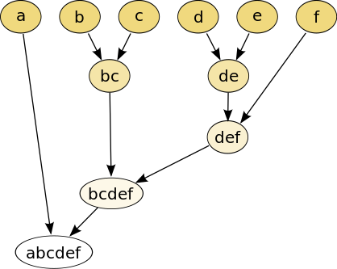
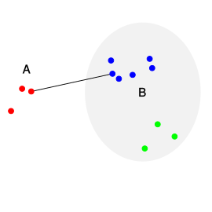
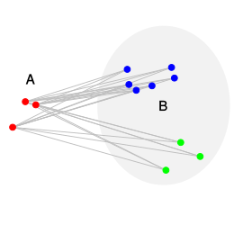
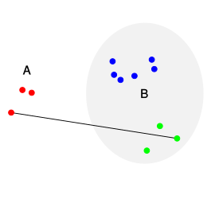
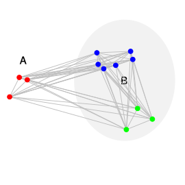

```{r setup, include=FALSE}

knitr::opts_chunk$set(message = FALSE)

```

```{r load-packages, message=FALSE}

# load required packages
# install them from CRAN, if not already present, with the following command (just uncomment the next line):
#install.packages(c("readr", "dplyr", "tidytext", "tidyr", "purrr", "usedist", "clusteval","dendextend", "ggplot2", "patchwork"))

library(readr)
library(dplyr)
library(tidytext)
library(tidyr)
library(purrr)
library(usedist)
library(clusteval)
library(dendextend)
library(ggplot2)
library(patchwork)

```

[](https://mybinder.org/v2/gh/sschmutz/optimization-method-project-2020/master?urlpath=rstudio)

*This R Markdown code can be executed on mybinder by following the link above.*

# Background

<div class = "row">
  
<div class = "col-md-6">
Microbial Forensics for body fluid identification is an interesting field of study. Human body sites have different patterns of microorganisms. High throughput sequencing techniques and open data sharing (e.g. [Sequence Read Archive](https://www.ncbi.nlm.nih.gov/sra)) allow us to create models which can classify unknown sample types.  
In 2018, Tackmann et al. published a study where they created a Random Forest Classifier to identify body site-specific microbial biomarkers.
</div>
  
<div class = "col-md-6">
[](https://microbiomejournal.biomedcentral.com/articles/10.1186/s40168-018-0565-6)
</div>
</div>

Since supervised machine learning algorithms like this often rely on large labeled datasets, a follow-up project now aims to update the dataset and re-train the model.

# Aim
In addition to the previously used approach of labeling the data by choosing appropriate keywords for each body-site, an experimental approach was done in parallel.  
The idea is to cluster samples of the same body-sites by analyzing their pairwise distance of keywords provided with the data. This report should evaluate if it's possible to do this by using a hierarchical clustering approach.

# Analysis
## Data

A manually labeled subset consisting of samples originating from feces (n=15), saliva (n=15) and skin (n=8) was selected to perform the proof of concept analysis.

Data structure:

```{r import-data}

# read labeled data and only keep one sample per study
SRA_meta <-
  read_delim("raw_data/SRA_human_metaInfo_20200301_labeled.tsv",
             delim = "\t", escape_double = FALSE, trim_ws = TRUE) %>%
  distinct(STUDY_ID, .keep_all = TRUE)

# set seed to make sampling reproducible
set.seed(20200417)

# select 15 feces samples
feces_ID <-
  SRA_meta %>%
  filter(CLASS == "feces") %>%
  sample_n(15) %>%
  pull(SAMPLE_ID)

# select 15 saliva samples
saliva_ID <-
  SRA_meta %>%
  filter(CLASS == "saliva") %>%
  sample_n(15) %>%
  pull(SAMPLE_ID)

# select 8 skin samples
skin_ID <-
  SRA_meta %>%
  filter(CLASS == "skin") %>%
  sample_n(8) %>%
  pull(SAMPLE_ID)

SRA_meta <-
  SRA_meta %>%
  filter(SAMPLE_ID %in% c(feces_ID, saliva_ID, skin_ID))


# split the list of keywords into rows containing a single keyword (token)
SRA_meta_tokens <-
  SRA_meta %>%
  unnest_tokens(keyword, KEYWORDS, token = "regex", pattern=";") %>%
  filter(keyword != "human")

# print the first 6 entries to show the structure of the data
head(SRA_meta %>% select(SAMPLE_ID, STUDY_ID, KEYWORDS, CLASS))
```

## Hierarchical Clustering
### Metric
In order to perform hierarchical clustering, a distance matrix describing pairwise distances has to be provided. Hamming or Levenshtein distance metric is often used for text or other non-numeric data.  
For this work, a different distance metric was chosen:


$1-\frac{\#\ shared\ Keywords}{\#\ total\ unique\ Keywords}$

Samples which share many keywords therefore have a low-, while samples with no identical keywords a high-pairwise distance value (on a scale from 0 to 1).

Structure of distance matrix (diagonal not shown):
```{r distance-matrix}

# this function takes two SAMPLE_IDs and returns the pairwise distance
keyword_distance <-
  function(ID_1, ID_2){
    token_df <- SRA_meta_tokens
    
    words_1 <-
      token_df %>%
      filter(SAMPLE_ID == ID_1) %>%
      pull(keyword)
    
    words_2 <-
      token_df %>%
      filter(SAMPLE_ID == ID_2) %>%
      pull(keyword)
    
    shared <- length(intersect(words_1, words_2))
    unique <- length(unique(c(words_1, words_2)))
    
    return(1-(shared/unique))
    
  }

# the distance matrix is created by applying the keyword_distance function defined above
SRA_meta_dist <-
  SRA_meta %>%
  expand(ID_first = SAMPLE_ID, ID_second = SAMPLE_ID) %>%
  filter(ID_first <= ID_second) %>%
  mutate(dist = map2_dbl(ID_first, ID_second, keyword_distance)) %>%
  pivot_wider(names_from = ID_first, values_from = dist) %>%
  select(-ID_second) %>%
  as.dist(diag = TRUE)

# print the first 4 entries to show the structure of the distance matrix
dist_subset(SRA_meta_dist, c("SRS483186", "ERS237394", "ERS1743608",
                             "ERS1232209", "ERS614262", "ERS1031177"))

```

### Type of clustering

<div class = "row">
  
<div class = "col-md-6">
In order to cluster the samples, a direction has to be defined.  
There are two options, either we start with all samples in one large cluster (top-down) or each sample is its own cluster (bottom-up).  
In this work, a bottom-up (agglomerative) approach was chosen.  

The Clustering is then done in a greedy manner. This means that at each step the local optimal choice is followed, which results in a time complexity of $\mathcal{O}(n^3)$.  
It would become an even more time-costly algorithm $\mathcal{O}(2^n)$ otherwise.  
This means we usually have to be satisfied with only finding a local optimum.

An example of such an agglomerative approach in a greedy manner is shown in the figure by Mhbrugman.
</div>
  
<div class = "col-md-6">
  
Source: Mhbrugman  
([wikipedia.org/wiki/Hierarchical_clustering](https://en.wikipedia.org/wiki/Hierarchical_clustering))
</div>
</div>

### Linkage criteria

Once the distance metric and type of clustering has been chosen, a linkage criteria has to be selected.  
The Linkage criteria determines the distance of two clusters. There are multiple options to choose from and they can potentially influence the outcome.  
Depending on the type of data at hand, a different criteria might be suitable.  
Some of the options are shown below.

<br/><br/>

<div class = "row">
  
<div class = "col-md-6">
Single-linkage (minimum distance)
  
Average-linkage (WPGMA)
  
</div>
  
<div class = "col-md-6">
Complete-linkage (maximum distance)
  
Average-group-linkage (UPGMA)
  
</div>
</div>

Source: Von Sigbert  
([wikipedia.org/wiki/Hierarchische_Clusteranalyse](https://de.wikipedia.org/wiki/Hierarchische_Clusteranalyse))

## Results
Using the four different linkage criteria described above, dendrograms can be used to represent the clustering trees.  
Since in this case it's known that we should get three clusters, the desired number of groups (k=3) was specified.  

To compare the performance of the different clustering methods, the Rand index was calculated for each compared to the known classes.  
The Rand index (value between 0 and 1) describes how similar two clusterings are, 1 being the exact same.

```{r hierarchical-clustering}

# clustering
SRA_meta_clust_single <- hclust(SRA_meta_dist, method = "single")
SRA_meta_clust_complete <- hclust(SRA_meta_dist, method = "complete")
SRA_meta_clust_WPGMA <- hclust(SRA_meta_dist, method = "mcquitty")
SRA_meta_clust_UPGMA <- hclust(SRA_meta_dist, method = "average")


# clustering performance
rand_index <- function(df){
  comembership <- clusteval::comembership_table(df$CLASS, df$cluster)
  n_11 <- comembership[[1]]
  n_10 <- comembership[[2]]
  n_01 <- comembership[[3]]
  n_00 <- comembership[[4]]
  
  R <- (n_11 + n_00)/(n_11 + n_10 + n_01 + n_00)
  
  return(format(round(R, digits = 2), nsmall = 2))
}

SRA_meta_clust_single_3 <-
  bind_rows(cutree(SRA_meta_clust_single, k = 3)) %>%
  pivot_longer(everything(), names_to = "SAMPLE_ID", values_to = "cluster") %>%
  left_join(SRA_meta, by = "SAMPLE_ID") %>%
  mutate(CLASS = factor(CLASS))

SRA_meta_clust_complete_3 <-
  bind_rows(cutree(SRA_meta_clust_complete, k = 3)) %>%
  pivot_longer(everything(), names_to = "SAMPLE_ID", values_to = "cluster") %>%
  left_join(SRA_meta, by = "SAMPLE_ID") %>%
  mutate(CLASS = factor(CLASS))

SRA_meta_clust_WPGMA_3 <-
  bind_rows(cutree(SRA_meta_clust_WPGMA, k = 3)) %>%
  pivot_longer(everything(), names_to = "SAMPLE_ID", values_to = "cluster") %>%
  left_join(SRA_meta, by = "SAMPLE_ID") %>%
  mutate(CLASS = factor(CLASS))

SRA_meta_clust_UPGMA_3 <-
  bind_rows(cutree(SRA_meta_clust_UPGMA, k = 3)) %>%
  pivot_longer(everything(), names_to = "SAMPLE_ID", values_to = "cluster") %>%
  left_join(SRA_meta, by = "SAMPLE_ID") %>%
  mutate(CLASS = factor(CLASS))


# clustering plots
single <-
  SRA_meta_clust_single %>%
  as.dendrogram %>%
  set("branches_k_color", k = 3) %>%
  set("labels_cex", 0.4) %>%
  set("branches_lwd", 0.5) %>%
  as.ggdend() %>%
  ggplot() +
  ylim(-0.5, 1) +
  theme(axis.text=element_text(size=6)) +
  labs(title = "Single-linkage (minimum distance)",
       subtitle = paste("Rand index =", rand_index(SRA_meta_clust_single_3)))

complete <-
  SRA_meta_clust_complete %>%
  as.dendrogram %>%
  set("branches_k_color", k = 3) %>%
  set("labels_cex", 0.4) %>%
  set("branches_lwd", 0.5) %>%
  as.ggdend() %>%
  ggplot() +
  ylim(-0.5, 1) +
  theme(axis.text=element_text(size=6)) +
  labs(title = "Complete-linkage (maximum distance)",
       subtitle = paste("Rand index =", rand_index(SRA_meta_clust_complete_3)))

WPGMA <-
  SRA_meta_clust_WPGMA %>%
  as.dendrogram %>%
  set("branches_k_color", k = 3) %>%
  set("labels_cex", 0.4) %>%
  set("branches_lwd", 0.5) %>%
  as.ggdend() %>%
  ggplot() +
  ylim(-0.5, 1) +
  theme(axis.text=element_text(size=6)) +
  labs(title = "Average-linkage (WPGMA)",
       subtitle = paste("Rand index =", rand_index(SRA_meta_clust_WPGMA_3)))

UPGMA <-
  SRA_meta_clust_UPGMA %>%
  as.dendrogram %>%
  set("branches_k_color", k = 3) %>%
  set("labels_cex", 0.4) %>%
  set("branches_lwd", 0.5) %>%
  as.ggdend() %>%
  ggplot() +
  ylim(-0.5, 1) +
  theme(axis.text=element_text(size=6)) +
  labs(title = "Average-group-linkage (UPGMA)",
       subtitle = paste("Rand index =", rand_index(SRA_meta_clust_UPGMA_3)))

(single | complete) / (WPGMA | UPGMA)

```


## Discussion

Given a subset of samples where the class has been labeled manually, the presented method was able to distinguish reliable between those classes.  
One exception was the clustering using the single-linkage criteria, the solely method where the Rand-index was below one and the classification of the groups failed. While the performance of the other three tested linkage criteria were very similar.

A major drawback of this approach however lies not necessarily in the method, but the quality of the keywords. It's very important to have unambiguous labels which is unfortunately not always the case. Even trying to classify the samples by keywords manually is sometimes not possible and further information about the sample source (from e.g. the [BioSample](https://www.ncbi.nlm.nih.gov/biosample) database) has to be gathered.  
Another caveat is the time complexity. The creation of the pairwise distance matrix and the hierarchical clustering are very time intensive especially when intending to apply this method to many samples.  

When applied to a small subset of samples, this method could still provide with insights in the data structure and possibly provide information about prevalent/important keywords which were missed by using the conventional approach.


