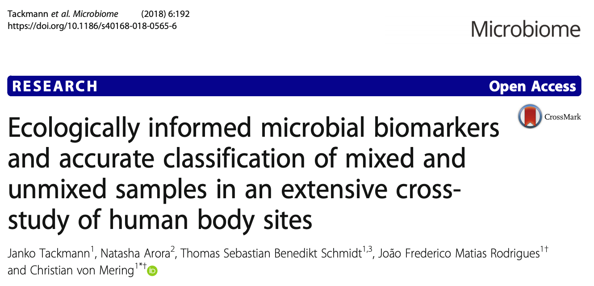

```{r setup, message=FALSE}

knitr::opts_chunk$set(message = FALSE)

# load required packages
# install them, if not already present, with the following command:
# install.packages(c("tidyverse", "tidytext", "dendextend", "cluster"))

library(tidyverse)
library(tidytext)
library(dendextend)
library(cluster)
library(usedist)
```

[](https://mybinder.org/v2/gh/sschmutz/optimization-method-project-2020/master?urlpath=rstudio)

This R Markdown code can be executed on mybinder by following the link above, the project can be found on GitHub ([sschmutz/optimization-method-project-2020](https://github.com/sschmutz/optimization-method-project-2020)).

# Background

<div class = "row">
  
<div class = "col-md-6">
Microbial Forensics for body fluid identification is an interesting field of study. Human body sites have different patterns of microorganisms, high throughput sequencing techinqes and open data sharing (e.g. [Sequence Read Archive](https://www.ncbi.nlm.nih.gov/sra)) allow us to create models which can classify unknown sample types.  
In 2018, Tackmann et al. published a study where they created a Random Forest Classifier to identify body site-specific microbial biomarkers.
</div>
  
<div class = "col-md-6">
[](https://microbiomejournal.biomedcentral.com/articles/10.1186/s40168-018-0565-6)
</div>
</div>

Since Machine learning algorithms like these often rely on large labeled datasets. A follow-up project now aims to update the dataset and re-train the model.

# Aim
In addition to the previously used approach of labeling the data by choosing appropriate keywords for each body-site, an experimental approach was done in parallel.  
The idea is to cluster samples of the same body-sites by analizing their pairwise distance of keywords provided with the data. This report should evaluate if it's possible to do this by using a hierarchical clustering approach.

# Analysis
## Data

A labeled subset consisting of samples originating from feces (n=15), saliva (n=15) and skin (n=8) was selected to perform the proof of concept analysis.

Data structure:

```{r import-data}

# read labeled data and only keep one sample per study
SRA_meta <-
  read_delim("raw_data/SRA_human_metaInfo_20200301_labeled.tsv",
             delim = "\t", escape_double = FALSE, trim_ws = TRUE) %>%
  distinct(STUDY_ID, .keep_all = TRUE)

# set seed to make sampling reproducible
set.seed(20200417)

# select 15 feces samples
feces_ID <-
  SRA_meta %>%
  filter(CLASS == "feces") %>%
  sample_n(15) %>%
  pull(SAMPLE_ID)

# select 15 saliva samples
saliva_ID <-
  SRA_meta %>%
  filter(CLASS == "saliva") %>%
  sample_n(15) %>%
  pull(SAMPLE_ID)

# select 8 skin samples
skin_ID <-
  SRA_meta %>%
  filter(CLASS == "skin") %>%
  sample_n(8) %>%
  pull(SAMPLE_ID)

SRA_meta <-
  SRA_meta %>%
  filter(SAMPLE_ID %in% c(feces_ID, saliva_ID, skin_ID))


# split the list of keywords into rows containing a single keyword (token)
SRA_meta_tokens <-
  SRA_meta %>%
  unnest_tokens(keyword, KEYWORDS, token = "regex", pattern=";") %>%
  filter(keyword != "human")

# print the first 6 entries to show the structure of the data
head(SRA_meta %>% select(SAMPLE_ID, STUDY_ID, KEYWORDS, CLASS))
```

## Hierarchical Clustering
### Metric
In order to perform hierarchical clustering, a distance matrix describing pairwise distances has to be provided. Hamming or Levenshtein distance metric is often used for text or other non-numeric data.  
For this work, a different distance metric was chosen:


$1-\frac{\#\ shared\ Keywords}{\#\ total\ unique\ Keywords}$

Samples which share many keywords therefore have a low- while samples with no identical keywords a high-pairwise distance value (on a scale from 0 to 1).

Structure of distance matrix:
```{r distance-matrix}

# this function takes two SAMPLE_IDs and returns the pairwise distance
keyword_distance <-
  function(ID_1, ID_2){
    token_df <- SRA_meta_tokens
    
    words_1 <-
      token_df %>%
      filter(SAMPLE_ID == ID_1) %>%
      pull(keyword)
    
    words_2 <-
      token_df %>%
      filter(SAMPLE_ID == ID_2) %>%
      pull(keyword)
    
    shared <- length(intersect(words_1, words_2))
    unique <- length(unique(c(words_1, words_2)))
    
    return(1-(shared/unique))
    
  }

# the distance matrix is created by applying the keyword_distance function defined above
SRA_meta_dist <-
  SRA_meta %>%
  expand(ID_first = SAMPLE_ID, ID_second = SAMPLE_ID) %>%
  filter(ID_first <= ID_second) %>%
  mutate(dist = map2_dbl(ID_first, ID_second, keyword_distance)) %>%
  pivot_wider(names_from = ID_first, values_from = dist) %>%
  select(-ID_second) %>%
  as.dist(diag = TRUE)

# print the first 6 entries to show the structure of the distance matrix
dist_subset(SRA_meta_dist, c("SRS483186", "ERS237394", "ERS1743608", "ERS1232209", "ERS614262", "ERS1031177"))

```

### Linkage criteria

```{r heatmap}

heatmap(as.matrix(SRA_meta_dist))

```


```{r hierarchical-clustering}

SRA_meta_clust <- hclust(SRA_meta_dist)

SRA_meta_clust %>%
  as.dendrogram %>%
  set("branches_k_color", k = 3) %>% 
  plot()

SRA_meta_clust_3 <-
  bind_rows(cutree(SRA_meta_clust, k = 3)) %>%
  pivot_longer(everything(), names_to = "SAMPLE_ID", values_to = "cluster") %>%
  left_join(SRA_meta_tokens, by = "SAMPLE_ID")

SRA_meta_clust_3 %>%
  ggplot(aes(x = CLASS, y = cluster))+
  geom_jitter() +
  labs(x = NULL)

```

## Discussion

```{r summarize-clusters}

keyword_summary <- 
  SRA_meta_clust_3 %>%
  group_by(cluster) %>%
  count(keyword, sort = TRUE) %>%
  arrange(cluster)

```


